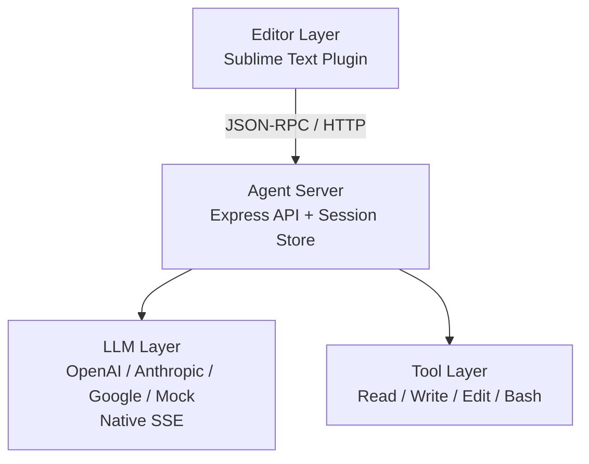
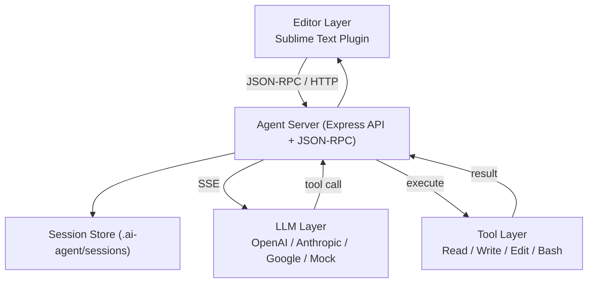

# Maclaw (Mac向けミニAIエージェント)

**言語:** [English](README.md) | [한국어](README-KR.md) | [日本語](README-JP.md)

Maclawは軽量コアと最小限のシステムプロンプトを基盤に、エージェントの自己学習と発展を志向するPi系AIエージェントです。

Pi系のOpenClawに着想を得ていますが、セキュリティ・コスト・ガバナンスの観点で、ユーザーがより高い統制権を維持できるようにする実験的プロジェクトです。

現在はローカル環境（Mac + Sublime Text）で動作するMVP v1.3段階で、Mock/実LLM（OpenAI/Anthropic/Google）の選択、JSON-RPCストリーミング（native SSE）、Macターミナルとの相互作用を提供します。

## プロジェクト構成（アーキテクチャ）

```
┌──────────────────────────────────────────────┐
│                Editor Layer                  │
│  - Sublime Text Plugin (MVP)                 │
└───────────────────┬──────────────────────────┘
                    │ JSON-RPC / HTTP
┌───────────────────▼──────────────────────────┐
│                Agent Server                  │
│  - Express API                               │
│  - Session Store (.ai-agent/sessions)        │
└───────────────────┬──────────────────────────┘
                    │
┌───────────────────▼──────────────────────────┐
│                LLM Layer                     │
│  - OpenAI / Anthropic / Google / Mock        │
│  - Native SSE Streaming                      │
└───────────────────┬──────────────────────────┘
                    │
┌───────────────────▼──────────────────────────┐
│               Tool Layer                     │
│  - Read / Write / Edit / Bash                │
│  - Project Root Path Limit                   │
└──────────────────────────────────────────────┘
```

### Mermaid 図



### Mermaid 図（拡張）



## 主な実装内容

### 1) エージェントサーバー（MVP）
- Expressベースのローカルサーバー
- 基本エンドポイント: `/health`, `/api/agent/process`, `/api/agent/sessions`, `/api/agent/sessions/:id`
- JSON-RPC 2.0 エンドポイント: `/rpc`
- ターミナル実行承認API: `/api/agent/terminal/request`, `/api/agent/terminal/execute`

### 2) セッション管理
- ディスク保存: `.ai-agent/sessions/`
- セッション生成/参照/一覧
- メッセージ履歴保存

### 3) LLM連携（OpenAI/Anthropic/Google）
- モデル設定: `~/.ai-agent/config.json`
- OpenAI/Anthropic/Google REST呼び出し
- Mock LLM対応
- エラー詳細分岐（権限/クォータ/モデル未対応 など）

### 4) ストリーミング（JSON-RPC + Native SSE）
- `/rpc`でJSON-RPCストリーミング
- 実LLMのSSEストリームをデルタ配信
- ツール呼び出し（function/tool call）イベント配信

### 5) 基本ツールレイヤー
- ファイル Read/Write/Edit
- Bashコマンド実行
- プロジェクトルート制限

### 6) Sublime Textプラグイン（MVP）
- コマンド: チャット/選択編集/ファイルレビュー
- ストリーミングをOutput Panelに表示
- インラインdiff + 承認/拒否UI
- 履歴/全体一覧とカラー区分ポップアップ
- ターミナル実行の承認ポップアップ
- 開いているドキュメント全体を自動コンテキスト
- リクエスト/レスポンス領域を分離表示

## 配布戦略 / ロードマップ

### 配布戦略
- **ローカル優先**: ユーザーのローカル環境で実行
- **クラウド拡張**: 必要に応じて外部LLM/リモート実行と連携
- **エディタ中心**: Sublimeプラグインで実運用検証
- **最小依存**: 軽量ランタイムと単純な配布構成

### ロードマップ（概要）
1. **MVP安定化**: ストリーミング/セッション/ツール呼び出しの安定化
2. **UX強化**: インラインdiff、部分承認、状態表示
3. **ツール実行ループ**: tool call → 実行 → 結果反映
4. **配布拡張**: ローカル/クラウド統合ガイド整備

## 配布ガイド（ローカル / クラウド）

### ローカル実行
1. 依存関係: `npm install`
2. ローカルサーバー: `npm run dev`
3. 設定ファイル: `~/.ai-agent/config.json`
4. エディタ連携: `sublime/README.md`

### クラウド実行（例）
1. Node.js 20+ を準備
2. ソース配置またはコンテナビルド
3. 環境変数/設定:
   - `~/.ai-agent/config.json` または環境変数（将来拡張）
4. ポート公開とアクセス制御:
   - `PORT` 指定
   - firewall/ACL で制限
5. クライアント接続:
   - SublimeプラグインのサーバーURLをクラウドに変更

### Docker/Compose
1. ローカル設定: `./config/config.json`
2. セッション保存: `./data/`
3. ビルド/実行:
```bash
docker compose up -d --build
```
4. 確認: `http://localhost:3000/health`

### Nginx プロキシ（ストリーミング対応）
`nginx/nginx.conf`にストリーミング向け設定があります。
- `proxy_buffering off`
- `proxy_read_timeout 3600s`

Compose使用時は Nginx コンテナが `maclaw` をプロキシします。

### 運用メモ
- LLMキーはサーバーのみで管理し、クライアントには保存しません。
- ストリーミングは長時間になる可能性があるためタイムアウトに注意。
- ログにAPIキーや機密プロンプトを残さないこと。

## クイックスタート

```bash
npm install
npm run dev
```

## API

### POST `/api/agent/process`
```json
{
  "prompt": "この関数を最適化して",
  "context": {
    "file": "/path/to/file.py",
    "selection": "def slow_function()...",
    "range": [10, 25]
  },
  "model": {
    "provider": "openai",
    "model": "gpt-4o-mini"
  }
}
```

#### curl 例
```bash
curl -s http://localhost:3000/api/agent/process \
  -H "Content-Type: application/json" \
  -d '{
    "prompt": "この関数を最適化して",
    "context": {
      "file": "/path/to/file.py",
      "selection": "def slow_function()...",
      "range": [10, 25]
    },
    "model": { "provider": "openai", "model": "gpt-4o-mini" }
  }'
```

### POST `/rpc` (JSON-RPC)
```json
{
  "jsonrpc": "2.0",
  "method": "agent.process",
  "params": {
    "prompt": "選択範囲を改善して",
    "context": {
      "file": "/path/to/file.py",
      "selection": "def slow_function()...",
      "range": [10, 25]
    },
    "stream": true
  },
  "id": 1
}
```

#### curl 例（ストリーミング）
```bash
curl -N http://localhost:3000/rpc \
  -H "Content-Type: application/json" \
  -d '{
    "jsonrpc": "2.0",
    "method": "agent.process",
    "params": {
      "prompt": "選択範囲を改善して",
      "context": {
        "file": "/path/to/file.py",
        "selection": "def slow_function()...",
        "range": [10, 25]
      },
      "stream": true
    },
    "id": 1
  }'
```

#### JSON-RPC ストリーミング応答例
```json
{"jsonrpc":"2.0","result":{"type":"start","sessionId":"8f7e..."},"id":1}
{"jsonrpc":"2.0","result":{"type":"delta","content":"こんにちは。"},"id":1}
{"jsonrpc":"2.0","result":{"type":"tool","name":"read","arguments":"{\"path\":\"/path/to/file.py\"}"},"id":1}
{"jsonrpc":"2.0","result":{"type":"delta","content":"コードを確認しました。"},"id":1}
{"jsonrpc":"2.0","result":{"type":"final","result":{"type":"message","content":"最終応答です。"}},"id":1}
```

### GET `/api/agent/sessions`
セッション一覧

### GET `/api/agent/sessions/:id`
セッション詳細

## 設定ファイル
`~/.ai-agent/config.json`で既定モデルを指定できます。
```json
{
  "defaultModel": {
    "provider": "mock",
    "model": "mock-1"
  },
  "providers": {
    "openai": { "apiKey": "YOUR_KEY" },
    "anthropic": { "apiKey": "YOUR_KEY" },
    "google": { "apiKey": "YOUR_KEY" }
  }
}
```

## Sublime Text プラグイン
`sublime/README.md` を参照してください。

### ショートカット（macOS）
- `Cmd+Shift+A`: エージェントに問い合わせ
- `Cmd+Shift+E`: 選択範囲の改善
- `Cmd+Shift+R`: ファイル全体レビュー
- `Cmd+Shift+H`: 直近セッションの履歴
- `Cmd+Shift+L`: 全セッションのテキスト一覧
- `Cmd+Shift+C`: 全セッションのカラー一覧

### ターミナル承認ポップアップ（自動検知）
以下の形式が含まれると承認ポップアップが表示されます。

```text
terminal: ls -la
```

````text
```bash
ls -la
```
````

- 複数ブロックは順番に承認されます。
- `常に許可/常に拒否`のポリシーを選べます。
- ポップアップはXを押すまで保持されます。
- 実行結果はセッション履歴に自動保存されます。

#### ターミナル連携フロー
1. 応答内の `terminal:` または ```bash``` ブロックを検出
2. 承認ポップアップを表示
3. 承認時にサーバー側で実行
4. Output Panelに結果表示 + セッション履歴に保存

## 作業まとめ（計画/ビルド/変更）
- **計画**: Maclawの目的/範囲の定義、ローカル・クラウド実行中心の方針確定
- **ビルド**: Expressサーバー + LLM層 + セッション保存 + JSON-RPCストリーミング
- **統合**: OpenAI/Anthropic/Google実呼び出し + native SSE
- **エディタ**: SublimeプラグインMVP、ストリーミング表示、インラインdiff承認
- **履歴**: セッション/全体履歴、時刻表示、カラー区分
- **安全実行**: ターミナル承認フロー（要求→承認→実行）
- **配布**: Docker/Compose + Nginxストリーミング設定
