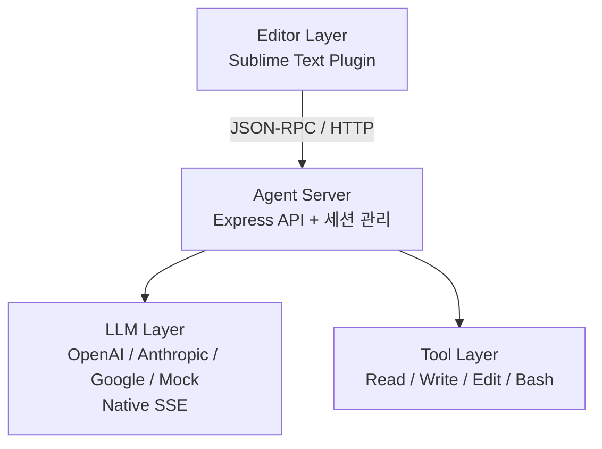
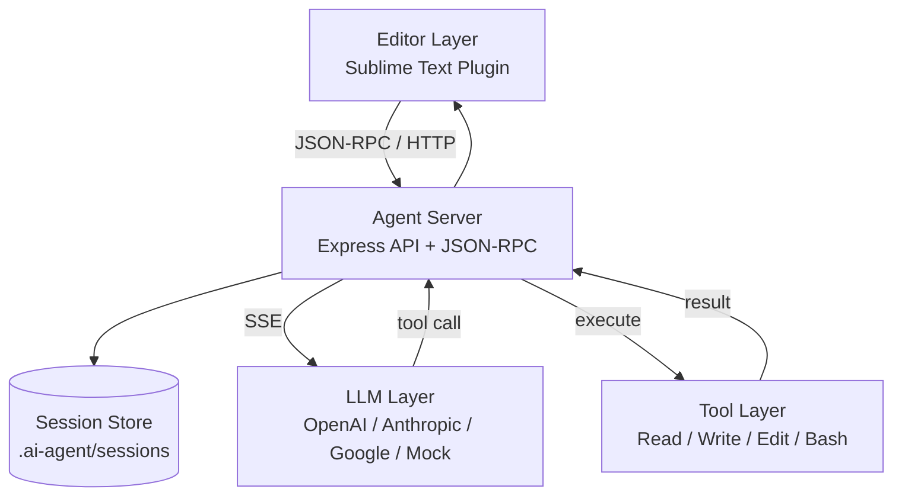

# Maclaw (Pi 기반 미니멀 코딩 에이전트)

Maclaw는 Pi 철학을 계승한 미니멀 AI 코딩 에이전트입니다.  
OpenClaw와 동일한 배포 목적을 가지며, 글로벌 사용자가 자신이 선호하는 **로컬 또는 클라우드 컴퓨팅 환경**에서 에이전트 기능을 활용할 수 있도록 돕습니다.

현재는 로컬환경 (Mac + Sublime Text)에서 실행되는 MVP 단계이며, Mock/실제 LLM(OpenAI/Anthropic/Google) 선택, JSON-RPC 스트리밍(native SSE)까지 제공합니다. 

## 프로젝트 구조도 (아키텍처)

```
┌──────────────────────────────────────────────┐
│                Editor Layer                  │
│  - Sublime Text Plugin (MVP)                 │
└───────────────────┬──────────────────────────┘
                    │ JSON-RPC / HTTP
┌───────────────────▼──────────────────────────┐
│                Agent Server                  │
│  - Express API                               │
│  - 세션 관리 (.ai-agent/sessions)            │
└───────────────────┬──────────────────────────┘
                    │
┌───────────────────▼──────────────────────────┐
│                LLM Layer                     │
│  - OpenAI / Anthropic / Google / Mock        │
│  - Native SSE 스트리밍                       │
└───────────────────┬──────────────────────────┘
                    │
┌───────────────────▼──────────────────────────┐
│               Tool Layer                     │
│  - Read / Write / Edit / Bash                │
│  - 프로젝트 루트 경로 제한                    │
└──────────────────────────────────────────────┘
```

### Mermaid 다이어그램



### Mermaid 다이어그램 (확장)



## 주요 작업 정리

### 1) 에이전트 서버(MVP)
- Express 기반 로컬 서버 구축
- 기본 엔드포인트: `/health`, `/api/agent/process`, `/api/agent/sessions`, `/api/agent/sessions/:id`
- JSON-RPC 2.0 엔드포인트: `/rpc`
- 터미널 실행 승인 API: `/api/agent/terminal/request`, `/api/agent/terminal/execute`

### 2) 세션 관리
- 디스크 기반 세션 저장: `.ai-agent/sessions/`
- 세션 생성/조회/목록 기능
- 메시지 히스토리 기록

### 3) LLM 연동(OpenAI/Anthropic/Google)
- 모델 설정 로드: `~/.ai-agent/config.json`
- OpenAI/Anthropic/Google REST 호출 구현
- Mock LLM 지원
- 에러 상세 분기(권한/쿼터/모델 미지원 등)

### 4) 스트리밍(JSON-RPC + Native SSE)
- `/rpc`에서 JSON-RPC 스트리밍 지원
- 실제 LLM SSE 스트림을 읽어 델타 전송
- 툴 호출(function/tool call) 스트림 이벤트 전송

### 5) 기본 도구 레이어
- 파일 Read/Write/Edit
- Bash 명령 실행
- 작업 경로 제한(프로젝트 루트)

### 6) Sublime Text 플러그인(MVP)
- 커맨드: 대화/선택 편집/파일 리뷰
- 스트리밍 결과 Output Panel 출력
- 인라인 diff 팝업 + 수락/거부 UI
- 대화 기록/전체 목록 보기 및 컬러 구분 팝업
- 터미널 명령 승인 팝업 실행
- 현재 열려 있는 문서 전체 컨텍스트 포함
- 요청/응답 영역 분리 출력

## 배포 전략 / 로드맵

### 배포 전략
- **로컬 우선**: 사용자가 선택한 로컬 환경에서 실행
- **클라우드 확장**: 필요 시 외부 LLM 또는 원격 실행 환경 연결
- **에디터 중심**: Sublime 플러그인으로 실제 워크플로우 검증
- **최소 의존성**: 작은 런타임과 단순한 배포 구조 유지

### 로드맵(요약)
1. **MVP 안정화**: 스트리밍/세션/툴 호출 처리 안정화
2. **에디터 UX 고도화**: 인라인 diff, 부분 수락, 상태 표시
3. **툴 실행 루프**: tool call → 실행 → 결과 반영
4. **배포 확장**: 로컬/클라우드 통합 실행 가이드 정리

## 배포 가이드 (로컬 / 클라우드)

### 로컬 실행
1. 의존성 설치: `npm install`
2. 로컬 서버 실행: `npm run dev`
3. 설정 파일 생성: `~/.ai-agent/config.json`
4. 에디터 연동: `sublime/README.md` 참고

### 클라우드 실행(예시)
1. 서버 환경 준비: Node.js 20+ 설치
2. 프로젝트 배포: 소스 업로드 또는 컨테이너 이미지 생성
3. 환경 변수/설정 제공:
   - `~/.ai-agent/config.json` 또는 환경 변수 기반 구성(추후 확장)
4. 포트 공개 및 접근 제어:
   - `PORT` 지정
   - 방화벽/ACL로 접근 제한
5. 클라이언트 연결:
   - Sublime 플러그인의 서버 주소를 클라우드 주소로 변경

### Docker/Compose 배포
1. 로컬 설정 파일 준비: `./config/config.json`
2. 세션 저장용 디렉토리: `./data/`
3. 빌드/실행:
```bash
docker compose up -d --build
```
4. 접속 확인: `http://localhost:3000/health`

### Nginx 프록시 (스트리밍 포함)
`nginx/nginx.conf`에 스트리밍에 필요한 설정이 포함되어 있습니다.
- `proxy_buffering off`
- `proxy_read_timeout 3600s`

Compose 사용 시 Nginx 컨테이너가 `maclaw`로 프록시합니다.

### 운영 팁
- LLM 키는 서버에만 저장하고, 클라이언트에는 노출하지 않습니다.
- 스트리밍 연결은 장시간 유지될 수 있으므로 프록시 타임아웃을 확인합니다.
- 로그에는 API 키나 민감한 프롬프트를 남기지 않습니다.

## 빠른 시작

```bash
npm install
npm run dev
```

## API

### POST `/api/agent/process`
```json
{
  "prompt": "이 함수를 최적화해줘",
  "context": {
    "file": "/path/to/file.py",
    "selection": "def slow_function()...",
    "range": [10, 25]
  },
  "model": {
    "provider": "openai",
    "model": "gpt-4o-mini"
  }
}
```

#### curl 예시
```bash
curl -s http://localhost:3000/api/agent/process \
  -H "Content-Type: application/json" \
  -d '{
    "prompt": "이 함수를 최적화해줘",
    "context": {
      "file": "/path/to/file.py",
      "selection": "def slow_function()...",
      "range": [10, 25]
    },
    "model": { "provider": "openai", "model": "gpt-4o-mini" }
  }'
```

### POST `/rpc` (JSON-RPC)
```json
{
  "jsonrpc": "2.0",
  "method": "agent.process",
  "params": {
    "prompt": "선택 영역을 개선해줘",
    "context": {
      "file": "/path/to/file.py",
      "selection": "def slow_function()...",
      "range": [10, 25]
    },
    "stream": true
  },
  "id": 1
}
```

#### curl 예시 (스트리밍)
```bash
curl -N http://localhost:3000/rpc \
  -H "Content-Type: application/json" \
  -d '{
    "jsonrpc": "2.0",
    "method": "agent.process",
    "params": {
      "prompt": "선택 영역을 개선해줘",
      "context": {
        "file": "/path/to/file.py",
        "selection": "def slow_function()...",
        "range": [10, 25]
      },
      "stream": true
    },
    "id": 1
  }'
```

#### JSON-RPC 스트리밍 응답 예시
```json
{"jsonrpc":"2.0","result":{"type":"start","sessionId":"8f7e..."},"id":1}
{"jsonrpc":"2.0","result":{"type":"delta","content":"안녕하세요. "},"id":1}
{"jsonrpc":"2.0","result":{"type":"tool","name":"read","arguments":"{\"path\":\"/path/to/file.py\"}"},"id":1}
{"jsonrpc":"2.0","result":{"type":"delta","content":"코드를 확인했습니다."},"id":1}
{"jsonrpc":"2.0","result":{"type":"final","result":{"type":"message","content":"최종 응답입니다."}},"id":1}
```

### GET `/api/agent/sessions`
세션 목록 조회

### GET `/api/agent/sessions/:id`
세션 상세 조회

## 설정 파일
`~/.ai-agent/config.json`에 기본 모델을 지정할 수 있습니다.
```json
{
  "defaultModel": {
    "provider": "mock",
    "model": "mock-1"
  },
  "providers": {
    "openai": { "apiKey": "YOUR_KEY" },
    "anthropic": { "apiKey": "YOUR_KEY" },
    "google": { "apiKey": "YOUR_KEY" }
  }
}
```

## Sublime Text 플러그인
`sublime/README.md` 참고

## 이번 작업 요약 (기획/빌드/수정)
- **기획**: Maclaw 목적/범위 정의, 로컬·클라우드 실행 중심의 미니멀 에이전트 방향 확정
- **빌드**: Express 서버 + LLM 레이어 + 세션 저장 + JSON-RPC 스트리밍 구성
- **통합**: OpenAI/Anthropic/Google 실제 호출 + native SSE 스트리밍
- **에디터**: Sublime 플러그인 MVP, 스트리밍 표시, 인라인 diff/수락
- **히스토리**: 세션별/전체 대화 기록 출력 + 시간표시 + 컬러 구분
- **안전 실행**: 터미널 명령 승인 플로우(요청→승인→실행)
- **배포**: Docker/Compose + Nginx 스트리밍 프록시 예시 추가
