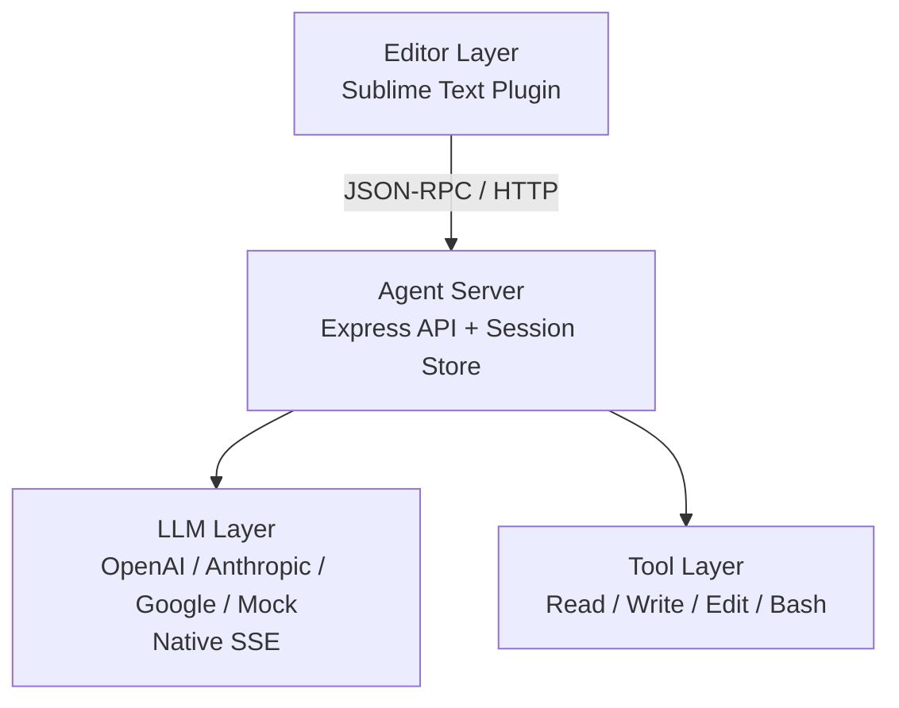
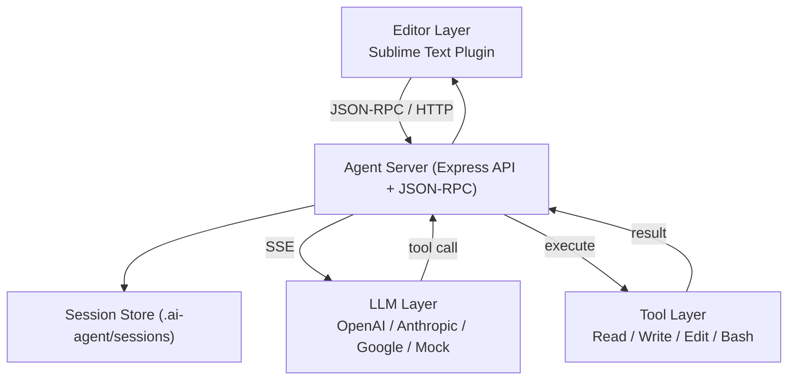

# Maclaw (Minimal AI Agent for Mac)

**Languages:** [English](README.md) | [한국어](README-KR.md) | [日本語](README-JP.md)

Maclaw is a Pi-inspired AI agent that aims for self-learning and evolution on a lightweight core with a minimal system prompt.

It started from ideas in OpenClaw, but is an experimental project focused on giving users higher control over security, cost, and governance.

This is MVP v1.3 running locally on Mac + Sublime Text. It supports Mock/real LLMs (OpenAI/Anthropic/Google), JSON-RPC streaming (native SSE), and Mac terminal interaction.

## Architecture

```
┌──────────────────────────────────────────────┐
│                Editor Layer                  │
│  - Sublime Text Plugin (MVP)                 │
└───────────────────┬──────────────────────────┘
                    │ JSON-RPC / HTTP
┌───────────────────▼──────────────────────────┐
│                Agent Server                  │
│  - Express API                               │
│  - Session Store (.ai-agent/sessions)        │
└───────────────────┬──────────────────────────┘
                    │
┌───────────────────▼──────────────────────────┐
│                LLM Layer                     │
│  - OpenAI / Anthropic / Google / Mock        │
│  - Native SSE Streaming                      │
└───────────────────┬──────────────────────────┘
                    │
┌───────────────────▼──────────────────────────┐
│               Tool Layer                     │
│  - Read / Write / Edit / Bash                │
│  - Project Root Path Limit                   │
└──────────────────────────────────────────────┘
```

### Mermaid Diagram



### Mermaid Diagram (Extended)



## Key Work Summary

### 1) Agent Server (MVP)
- Express-based local server
- Core endpoints: `/health`, `/api/agent/process`, `/api/agent/sessions`, `/api/agent/sessions/:id`
- JSON-RPC 2.0 endpoint: `/rpc`
- Terminal approval API: `/api/agent/terminal/request`, `/api/agent/terminal/execute`

### 2) Session Management
- Disk-backed sessions: `.ai-agent/sessions/`
- Create/read/list sessions
- Message history logging

### 3) LLM Integrations (OpenAI/Anthropic/Google)
- Model config: `~/.ai-agent/config.json`
- OpenAI/Anthropic/Google REST calls
- Mock LLM support
- Detailed error handling (auth/quota/model)

### 4) Streaming (JSON-RPC + Native SSE)
- JSON-RPC streaming via `/rpc`
- Stream real LLM SSE deltas
- Tool call (function/tool call) stream events

### 5) Base Tool Layer
- File Read/Write/Edit
- Bash command execution
- Project root path restrictions

### 6) Sublime Text Plugin (MVP)
- Commands: chat/selection edit/file review
- Streaming output to Output Panel
- Inline diff popup + accept/reject UI
- History and full list with color popups
- Terminal approval popup
- Full context of current document
- Request/response sections in Output Panel

## Deployment Strategy / Roadmap

### Strategy
- **Local-first**: run in user’s local environment
- **Cloud extension**: optional remote LLM or runtime
- **Editor-centric**: validate workflow via Sublime plugin
- **Minimal dependencies**: small runtime and simple packaging

### Roadmap (summary)
1. **MVP hardening**: stabilize streaming/session/tool calls
2. **Editor UX**: inline diff, partial accept, status UI
3. **Tool loop**: tool call → execute → feedback
4. **Deployment**: local/cloud integrated guide

## Deployment Guide (Local / Cloud)

### Local
1. Install dependencies: `npm install`
2. Run server: `npm run dev`
3. Create config: `~/.ai-agent/config.json`
4. Editor integration: see `sublime/README.md`

### Cloud (example)
1. Prepare server: Node.js 20+
2. Deploy: upload source or build container
3. Provide config:
   - `~/.ai-agent/config.json` or env-based config (future)
4. Open port and restrict access:
   - set `PORT`
   - firewall/ACL
5. Client connection:
   - point Sublime plugin to cloud URL

### Docker/Compose
1. Local config: `./config/config.json`
2. Session data dir: `./data/`
3. Build/run:
```bash
docker compose up -d --build
```
4. Health check: `http://localhost:3000/health`

### Nginx Proxy (Streaming)
`nginx/nginx.conf` includes streaming-friendly settings.
- `proxy_buffering off`
- `proxy_read_timeout 3600s`

With compose, Nginx proxies to `maclaw`.

### Ops Tips
- Keep LLM keys on the server only.
- Streaming connections can be long-lived; check proxy timeouts.
- Avoid logging API keys or sensitive prompts.

## Quick Start

```bash
npm install
npm run dev
```

## API

### POST `/api/agent/process`
```json
{
  "prompt": "Optimize this function",
  "context": {
    "file": "/path/to/file.py",
    "selection": "def slow_function()...",
    "range": [10, 25]
  },
  "model": {
    "provider": "openai",
    "model": "gpt-4o-mini"
  }
}
```

#### curl example
```bash
curl -s http://localhost:3000/api/agent/process \
  -H "Content-Type: application/json" \
  -d '{
    "prompt": "Optimize this function",
    "context": {
      "file": "/path/to/file.py",
      "selection": "def slow_function()...",
      "range": [10, 25]
    },
    "model": { "provider": "openai", "model": "gpt-4o-mini" }
  }'
```

### POST `/rpc` (JSON-RPC)
```json
{
  "jsonrpc": "2.0",
  "method": "agent.process",
  "params": {
    "prompt": "Improve the selected code",
    "context": {
      "file": "/path/to/file.py",
      "selection": "def slow_function()...",
      "range": [10, 25]
    },
    "stream": true
  },
  "id": 1
}
```

#### curl example (streaming)
```bash
curl -N http://localhost:3000/rpc \
  -H "Content-Type: application/json" \
  -d '{
    "jsonrpc": "2.0",
    "method": "agent.process",
    "params": {
      "prompt": "Improve the selected code",
      "context": {
        "file": "/path/to/file.py",
        "selection": "def slow_function()...",
        "range": [10, 25]
      },
      "stream": true
    },
    "id": 1
  }'
```

#### JSON-RPC streaming response example
```json
{"jsonrpc":"2.0","result":{"type":"start","sessionId":"8f7e..."},"id":1}
{"jsonrpc":"2.0","result":{"type":"delta","content":"Hello. "},"id":1}
{"jsonrpc":"2.0","result":{"type":"tool","name":"read","arguments":"{\"path\":\"/path/to/file.py\"}"},"id":1}
{"jsonrpc":"2.0","result":{"type":"delta","content":"I checked the code."},"id":1}
{"jsonrpc":"2.0","result":{"type":"final","result":{"type":"message","content":"Final response."}},"id":1}
```

### GET `/api/agent/sessions`
세션 목록 조회

### GET `/api/agent/sessions/:id`
세션 상세 조회

## Configuration
Set the default model in `~/.ai-agent/config.json`.
```json
{
  "defaultModel": {
    "provider": "mock",
    "model": "mock-1"
  },
  "providers": {
    "openai": { "apiKey": "YOUR_KEY" },
    "anthropic": { "apiKey": "YOUR_KEY" },
    "google": { "apiKey": "YOUR_KEY" }
  }
}
```

## Sublime Text Plugin
See `sublime/README.md`.

### Shortcuts (macOS)
- `Cmd+Shift+A`: chat request
- `Cmd+Shift+E`: edit selection
- `Cmd+Shift+R`: review file
- `Cmd+Shift+H`: recent session history
- `Cmd+Shift+L`: all sessions (text)
- `Cmd+Shift+C`: all sessions (color popup)

### Terminal Approval Popup (Auto Detect)
If the response includes one of the following, the approval popup is shown.

```text
terminal: ls -la
```

````text
```bash
ls -la
```
````

- Multiple command blocks are approved sequentially.
- You can choose `Always allow / Always deny` in the popup.
- The popup stays until you click X.
- Execution results are saved to the current session history.

#### Terminal Flow
1. Detect `terminal:` or ```bash``` blocks in the response
2. Show approval popup
3. Execute on the server after approval
4. Output to Output Panel + save to session history

## Work Summary (Planning/Build/Changes)
- **Planning**: defined scope and local/cloud-first direction
- **Build**: Express server + LLM layer + sessions + JSON-RPC streaming
- **Integration**: real OpenAI/Anthropic/Google calls + native SSE
- **Editor**: Sublime MVP, streaming, inline diff approvals
- **History**: session/all history + timestamps + color grouping
- **Safe execution**: terminal approval flow (request → approve → run)
- **Deployment**: Docker/Compose + Nginx streaming proxy example
